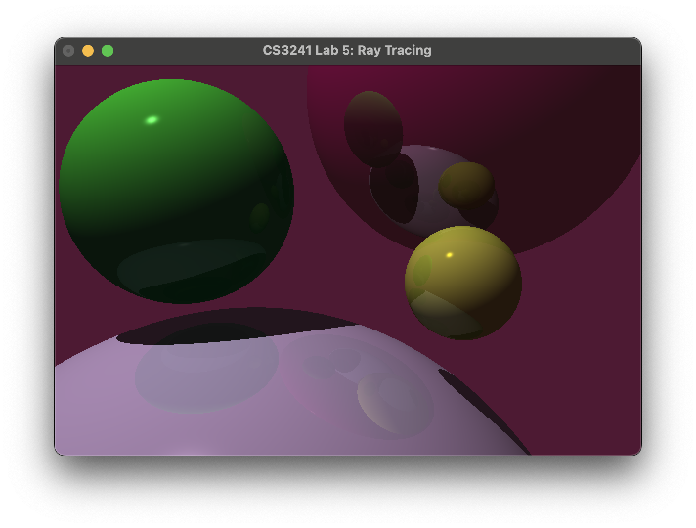
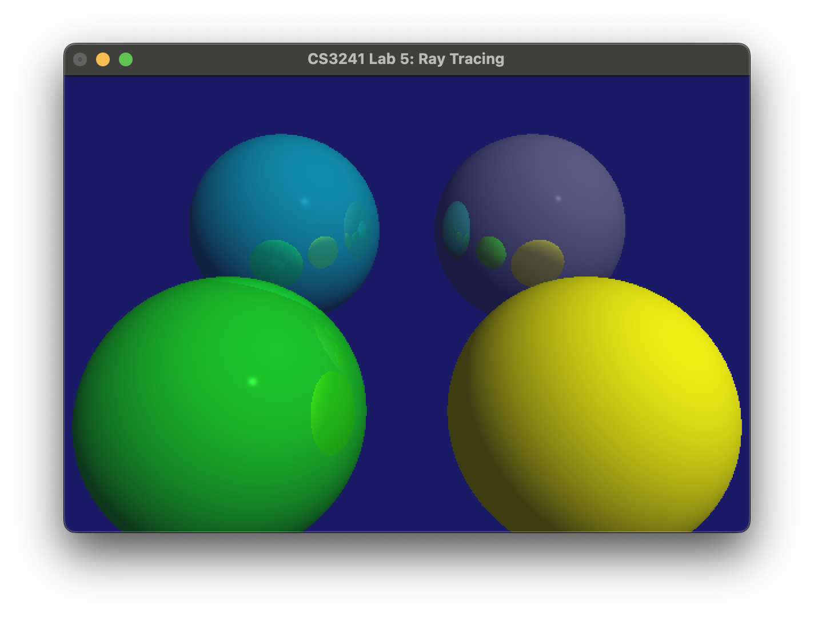
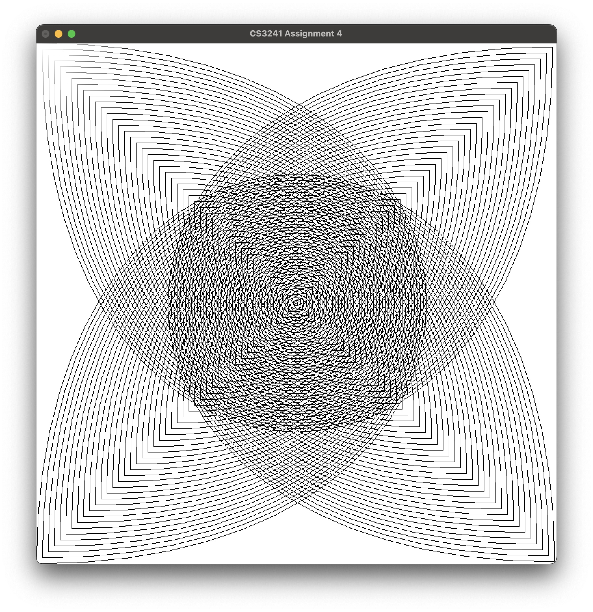
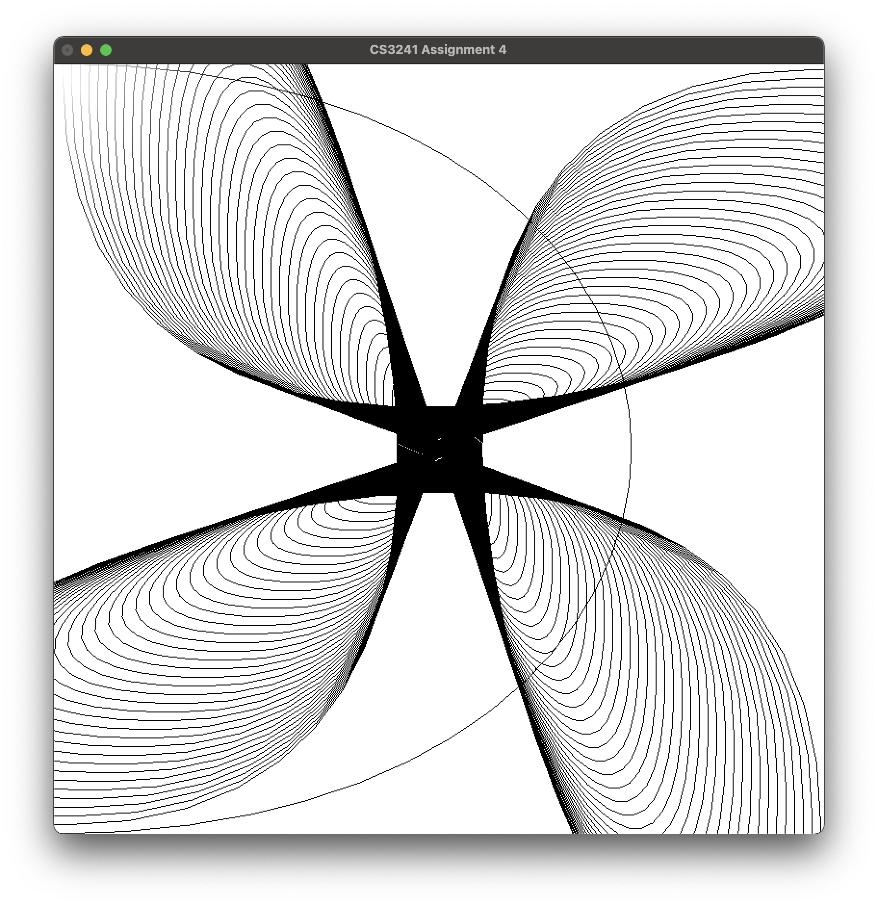
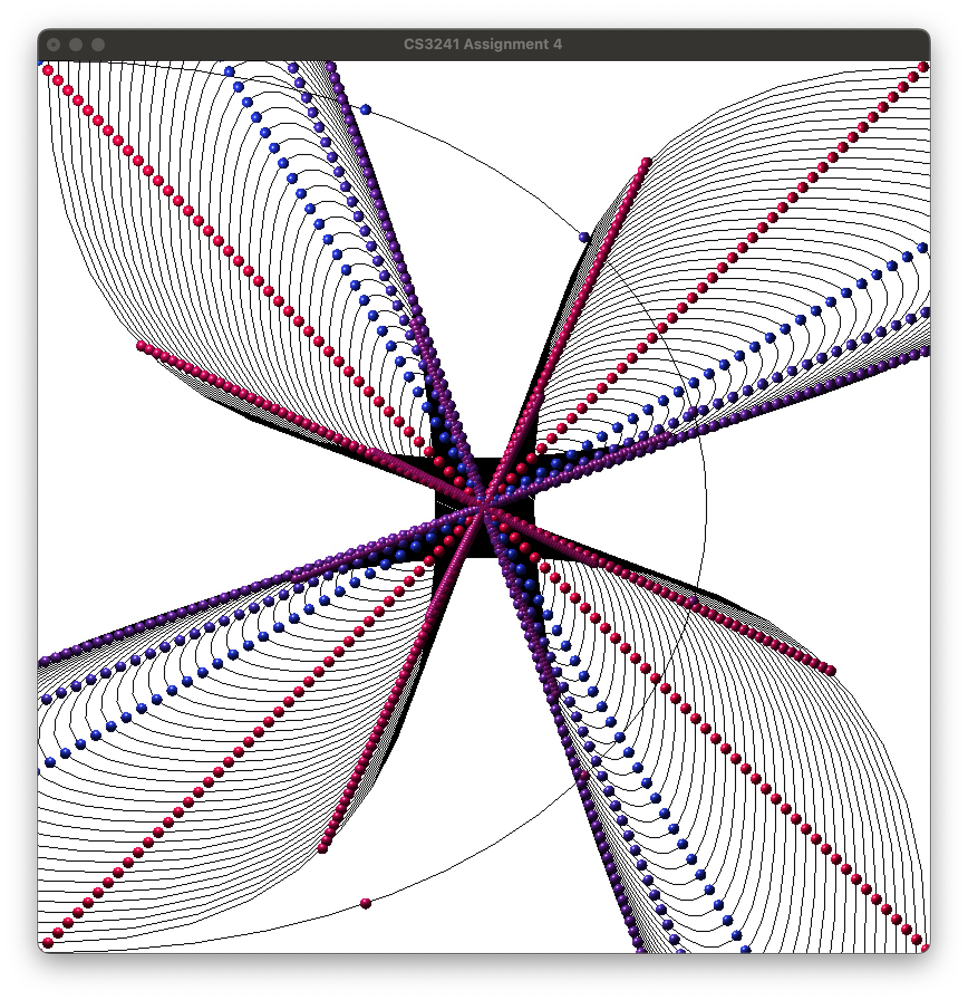
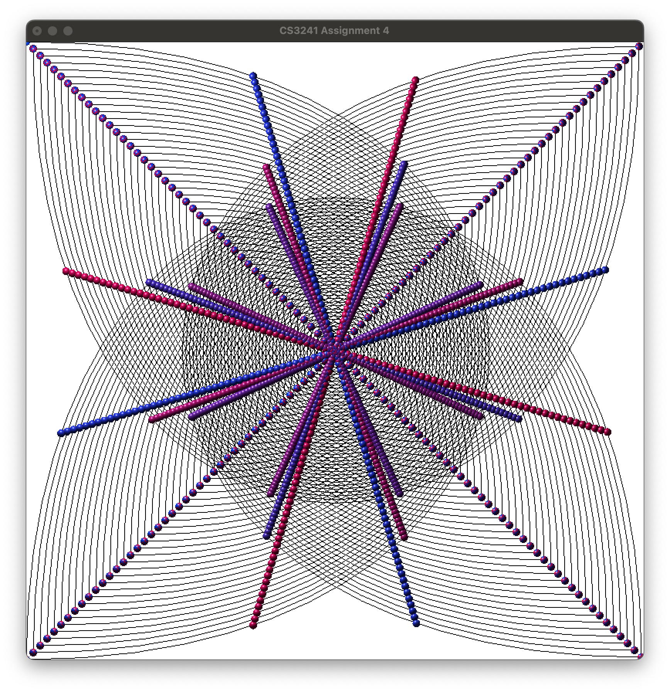

# Computer Graphics - CS3241
A collection of OpenGL projects and exercises for Computer Graphics class.

## Ray Tracing Renderer
A minimal recursive ray tracer with shadows, refections, Phong Illumination, and multi-scene rendering.




### Features
- Ray-sphere intersection
- Phong shading
- Hard shadows via shadow rays
- Recursive reflection

### Building and Running
Using Makefile:
```
make run
```
Manually:
```
g++ main.cpp -std=c++17 -framework GLUT -framework OpenGL -framework Cocoa -o main && ./main
```

## Solar System Simulation
An interactive 3D solar system with planetary motion, camera tracking, and multiple viewing modes built using OpenGL and GLUT.
[](https://youtu.be/z4otZGtN46M)

### Features
- Complete solar system with Sun, 8 planets, and 6 major moons
- Interactive camera system with planet tracking
- Hierarchical orbital mechanics
- Multiple viewing modes (angled and top-down)
- Wireframe rendering mode
- Clock mode with visual indicator

### Controls
- **0-8**: Focus camera on celestial bodies (0=Sun, 1=Mercury, 2=Venus, etc.)
- **E/R**: Zoom in/out
- **L**: Toggle between angled and top-down camera views
- **T**: Toggle clock mode (slowed animation)
- **F**: Toggle wireframe mode
- **ESC/Q**: Exit

### Building and Running
```bash
g++ -o main main.cpp -framework GLUT -framework OpenGL -DGL_SILENCE_DEPRECATION -framework Cocoa && ./main
```

---
## Bézier Curves
An interactive Bézier curve editor and visualizer with control points, C1 continuity, tangent vectors, and 3D object placement.  





### Features
- Add control points interactively  
- Toggle control lines, tangent vectors, and Bézier curves  
- Apply and remove **C1 continuity** between connected segments  
- Render **spinning 3D spheres** aligned with the curve tangents  
- Save and load control points (`savefile.txt`)  
- Auto-generate spiral-inward control patterns  

### Controls
- **Left Click**: Add control point  
- **C**: Toggle C1 continuity  
- **T**: Show tangent vectors  
- **O**: Show 3D objects along curve  
- **L/P/E**: Toggle lines, points, or clear all  
- **R/W**: Read/Write from file  
- **A**: Auto-place control points  
- **Q**: Exit  

### Building and Running
```bash
g++ -o main main.cpp -framework GLUT -framework OpenGL -DGL_SILENCE_DEPRECATION -framework Cocoa && ./main
```

## Interactive 3D Sphere
A wireframe sphere renderer with interactive camera controls built using OpenGL and GLUT.


### Controls
- **W/S**: Orbit camera up/down
- **Z/C**: Orbit camera left/right  
- **A/D**: Rotate sphere
- **Q/E**: Scale sphere up/down
- **ESC**: Exit

### Building and Running
```bash
g++ -o main main.cpp -framework GLUT -framework OpenGL -DGL_SILENCE_DEPRECATION -framework Cocoa && ./main
```

---

## 2D Skull Drawing (Assignment 1)
Strawhat Pirates Logo made in OpenGL.


### Features
- Display Lists: GPU-optimized rendering with pre-compiled commands
- Animated Background: Triangle wave color transitions
- Interactive Controls: Real-time transformation and scaling

### Controls
- **A/D**: Rotate skull clockwise/counter-clockwise
- **Q/E**: Scale up/down
- **W/S**: Move up/down
- **Z/C**: Move left/right
- **ESC**: Exit

### Building and Running
```bash
g++ -o main main.cpp -framework GLUT -framework OpenGL -DGL_SILENCE_DEPRECATION -framework Cocoa && ./main
```

---

*CS3241 Computer Graphics coursework*
